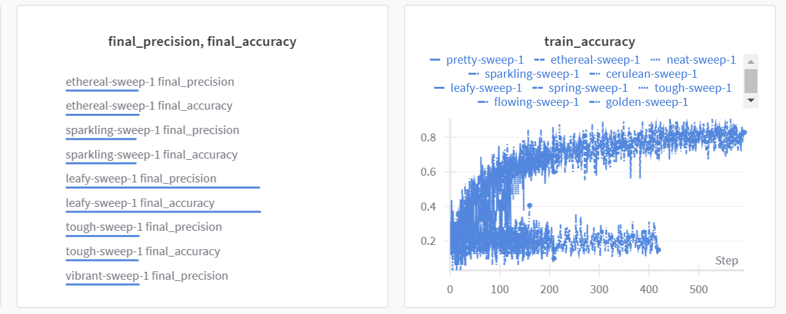
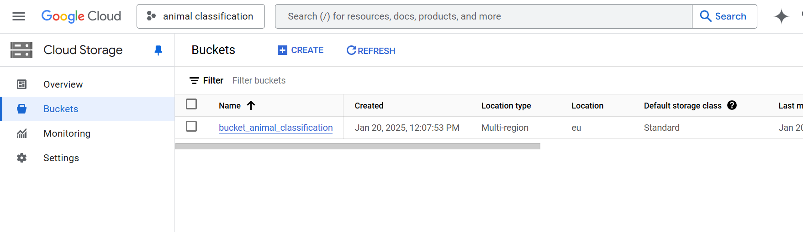
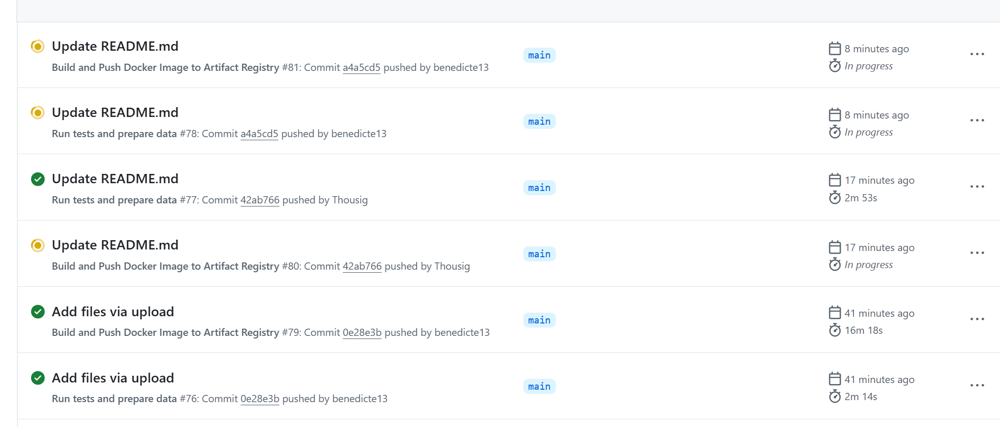

 # Exam template for 02476 Machine Learning Operations

This is the report template for the exam. Please only remove the text formatted as with three dashes in front and behind
like:

```--- question 1 fill here ---```

Where you instead should add your answers. Any other changes may have unwanted consequences when your report is
auto-generated at the end of the course. For questions where you are asked to include images, start by adding the image
to the `figures` subfolder (please only use `.png`, `.jpg` or `.jpeg`) and then add the following code in your answer:

```markdown

```

In addition to this markdown file, we also provide the `report.py` script that provides two utility functions:

Running:

```bash
python report.py html
```

Will generate a `.html` page of your report. After the deadline for answering this template, we will auto-scrape
everything in this `reports` folder and then use this utility to generate a `.html` page that will be your serve
as your final hand-in.

Running

```bash
python report.py check
```

Will check your answers in this template against the constraints listed for each question e.g. is your answer too
short, too long, or have you included an image when asked. For both functions to work you mustn't rename anything.
The script has two dependencies that can be installed with

```bash
pip install typer markdown
```

## Overall project checklist

The checklist is *exhaustive* which means that it includes everything that you could do on the project included in the
curriculum in this course. Therefore, we do not expect at all that you have checked all boxes at the end of the project.
The parenthesis at the end indicates what module the bullet point is related to. Please be honest in your answers, we
will check the repositories and the code to verify your answers.

### Week 1

* [x] Create a git repository (M5)
* [x] Make sure that all team members have write access to the GitHub repository (M5)
* [x] Create a dedicated environment for you project to keep track of your packages (M2)
* [x] Create the initial file structure using cookiecutter with an appropriate template (M6)
* [x] Fill out the `data.py` file such that it downloads whatever data you need and preprocesses it (if necessary) (M6)
* [x] Add a model to `model.py` and a training procedure to `train.py` and get that running (M6)
* [x] Remember to fill out the `requirements.txt` and `requirements_dev.txt` file with whatever dependencies that you
    are using (M2+M6)
* [x] Remember to comply with good coding practices (`pep8`) while doing the project (M7)
* [x] Do a bit of code typing and remember to document essential parts of your code (M7)
* [x] Setup version control for your data or part of your data (M8)
* [ ] Add command line interfaces and project commands to your code where it makes sense (M9)
* [x] Construct one or multiple docker files for your code (M10)
* [x] Build the docker files locally and make sure they work as intended (M10)
* [x] Write one or multiple configurations files for your experiments (M11)
* [ ] Used Hydra to load the configurations and manage your hyperparameters (M11)
* [x] Use profiling to optimize your code (M12)
* [x] Use logging to log important events in your code (M14)
* [x] Use Weights & Biases to log training progress and other important metrics/artifacts in your code (M14)
* [x] Consider running a hyperparameter optimization sweep (M14)
* [ ] Use PyTorch-lightning (if applicable) to reduce the amount of boilerplate in your code (M15)

### Week 2

* [x] Write unit tests related to the data part of your code (M16)
* [x] Write unit tests related to model construction and or model training (M16)
* [x] Calculate the code coverage (M16)
* [x] Get some continuous integration running on the GitHub repository (M17)
* [x] Add caching and multi-os/python/pytorch testing to your continuous integration (M17)
* [ ] Add a linting step to your continuous integration (M17)
* [ ] Add pre-commit hooks to your version control setup (M18)
* [x] Add a continues workflow that triggers when data changes (M19)
* [x] Add a continues workflow that triggers when changes to the model registry is made (M19)
* [x] Create a data storage in GCP Bucket for your data and link this with your data version control setup (M21)
* [x] Create a trigger workflow for automatically building your docker images (M21)
* [x] Get your model training in GCP using either the Engine or Vertex AI (M21)
* [ ] Create a FastAPI application that can do inference using your model (M22)
* [ ] Deploy your model in GCP using either Functions or Run as the backend (M23)
* [ ] Write API tests for your application and setup continues integration for these (M24)
* [ ] Load test your application (M24)
* [ ] Create a more specialized ML-deployment API using either ONNX or BentoML, or both (M25)
* [ ] Create a frontend for your API (M26)

### Week 3

* [ ] Check how robust your model is towards data drifting (M27)
* [ ] Deploy to the cloud a drift detection API (M27)
* [ ] Instrument your API with a couple of system metrics (M28)
* [ ] Setup cloud monitoring of your instrumented application (M28)
* [ ] Create one or more alert systems in GCP to alert you if your app is not behaving correctly (M28)
* [ ] If applicable, optimize the performance of your data loading using distributed data loading (M29)
* [ ] If applicable, optimize the performance of your training pipeline by using distributed training (M30)
* [ ] Play around with quantization, compilation and pruning for you trained models to increase inference speed (M31)

### Extra

* [ ] Write some documentation for your application (M32)
* [ ] Publish the documentation to GitHub Pages (M32)
* [ ] Revisit your initial project description. Did the project turn out as you wanted?
* [ ] Create an architectural diagram over your MLOps pipeline
* [ ] Make sure all group members have an understanding about all parts of the project
* [x] Uploaded all your code to GitHub

## Group information

### Question 1
> **Enter the group number you signed up on <learn.inside.dtu.dk>**
>
> Answer:

86

### Question 2
> **Enter the study number for each member in the group**
>
> Example:
>
> 
>
> Answer:

--- question 2 fill here ---
s234873, s234825, s234811
### Question 3
> **A requirement to the project is that you include a third-party package not covered in the course. What framework**
> **did you choose to work with and did it help you complete the project?**
>
> Recommended answer length: 100-200 words.
>
> Example:
> 
>
> Answer:
>
> 

--- question 3 fill here ---

We chose Gradio as our third-party framework because it’s intuitive, easy to use, and perfect for building interactive interfaces. One of our team members had prior experience with it, which helped us get started quickly and confidently. Gradio allowed us to create an engaging user interface for our project without needing to dive into complex UI design or spend extra time on front-end development.

Its practical features, such as drag-and-drop widgets, automatic hosting, and easy customization, simplified the process significantly. We were able to focus entirely on the core functionality of the project while Gradio took care of the interactive aspects.

Using Gradio not only saved us time but also allowed us to complete the project more efficiently and deliver a polished result. It was an excellent fit for our needs, and we’d highly recommend it to anyone looking to add interactivity to their projects quickly and easily.
https://gradio-api-132806470705.europe-west1.run.app/


## Coding environment

> In the following section we are interested in learning more about you local development environment. This includes
> how you managed dependencies, the structure of your code and how you managed code quality.

### Question 4

> **Explain how you managed dependencies in your project? Explain the process a new team member would have to go**
> **through to get an exact copy of your environment.**
>
> Recommended answer length: 100-200 words
>
> Example:
> *We used ... for managing our dependencies. The list of dependencies was auto-generated using ... . To get a*
> *complete copy of our development environment, one would have to run the following commands*
>
> Answer:
>
--- question 4 fill here ---


We managed dependencies in our project by creating a conda environment to isolate them from other projects. As we encountered new challenges, we installed the necessary packages within this environment to ensure everything was organized and consistent. To keep track of these dependencies, we regularly updated requirements.txt and requirements_dev.txt using the command pipreqs --force, which scans the project and automatically lists all the required dependencies.

For a new team member to set up the exact same environment, they would first create a conda environment and activate it. Then, they could simply run pip install -r requirements.txt to install all the necessary packages for the project. This approach ensured that everyone worked in the same environment and minimized potential issues with missing or incompatible dependencies. It was a straightforward process that kept our project’s setup clear and easy to replicate.


### Question 5

> **We expect that you initialized your project using the cookiecutter template. Explain the overall structure of your**
> **code. What did you fill out? Did you deviate from the template in some way?**
>
> Recommended answer length: 100-200 words
>
> Example:
> *From the cookiecutter template we have filled out the ... , ... and ... folder. We have removed the ... folder*
> *because we did not use any ... in our project. We have added an ... folder that contains ... for running our*
> *experiments.*
>
> Answer:
>
> We used the cookiecutter template from the course. We followed the structure of the folder pretty tightly as it aligned well with our needs. We filled out dockerfiles with api.dockerfile, evaluate.dockerfile and train.dockerfile and in src/animal_classification we created data.py, evaluate.py and api.py. We did not use the data folder as we pushed and stored everything in the google cloud storage bucket.
> 

--- question 5 fill here ---

### Question 6

> **Did you implement any rules for code quality and format? What about typing and documentation? Additionally,**
> **explain with your own words why these concepts matters in larger projects.**
>
> Recommended answer length: 100-200 words.
>
> Example:
> *We used ... for linting and ... for formatting. We also used ... for typing and ... for documentation. These*
> *concepts are important in larger projects because ... . For example, typing ...*
>
> Answer:

--- question 6 fill here ---

From previous projects, we have experienced that it is critical to document the code and write good comments. Thus, we agreed that we could not write code without any comments, since you quickly lose track of what different code does.

## Version control

> In the following section we are interested in how version control was used in your project during development to
> corporate and increase the quality of your code.

### Question 7

> **How many tests did you implement and what are they testing in your code?**
>
> Recommended answer length: 50-100 words.
>
> Example:
> *In total we have implemented X tests. Primarily we are testing ... and ... as these the most critical parts of our*
> *application but also ... .*
>
> Answer:

--- question 7 fill here ---

We have written eight tests in total. These cover the important parts of the app like making sure the AnimalClassificationCNN model gives the right output shape, works with small batches, and has trainable parameters. We also test the train function, the forward pass, check that dropout works properly, and verify the image transformation pipeline. On top of that, we’ve got a test to make sure the Gradio interface launches without any issues. These tests help us make sure the app works as expected.


### Question 8

> **What is the total code coverage (in percentage) of your code? If your code had a code coverage of 100% (or close**
> **to), would you still trust it to be error free? Explain you reasoning.**
>
> Recommended answer length: 100-200 words.
>
> Example:
> *The total code coverage of code is X%, which includes all our source code. We are far from 100% coverage of our **
> *code and even if we were then...*
>
> Answer:

--- question 8 fill here ---

Our total code coverage was 43% and tested some important aspects of our model. Some parts of our code was fairly well covered like the training and the model, while some had little or no coverage like data and evaluate. Even if our coverage was 100%, this would not mean that there aren't any errors in our code, it would just mean that every line of code was executed during the testing.


### Question 9

> **Did you workflow include using branches and pull requests? If yes, explain how. If not, explain how branches and**
> **pull request can help improve version control.**
>
> Recommended answer length: 100-200 words.
>
> Example:
> *We made use of both branches and PRs in our project. In our group, each member had an branch that they worked on in*
> *addition to the main branch. To merge code we ...*
>
> Answer:

--- question 9 fill here ---

In our project, we set up a workflow that automatically ran tests, built the project, and pushed updates to the cloud whenever we pulled or pushed changes. This made it easier to catch errors early and ensure the latest changes were always reflected in the cloud.

While we mainly worked on the main branch, using branches could improve our workflow even more. For example, if someone wants to make a change, they could create a new branch for it, test their changes locally, and only merge it into the main branch once everything works. This keeps the main branch stable and makes it easier to work on different features or fixes at the same time.


### Question 10

> **Did you use DVC for managing data in your project? If yes, then how did it improve your project to have version**
> **control of your data. If no, explain a case where it would be beneficial to have version control of your data.**
>
> Recommended answer length: 100-200 words.
>
> Example:
> *We did make use of DVC in the following way: ... . In the end it helped us in ... for controlling ... part of our*
> *pipeline*
>
> Answer:

--- question 10 fill here ---


We didn’t use DVC in our project because we relied on Google Cloud Storage to manage and store our data. We could imagine DVC being useful when working with large datasets that frequently change or need to be tracked alongside code versions. For example, in a collaborative project where multiple team members experiment with different data versions, DVC ensures consistency, reproducibility, and easy rollback to previous data states directly linked to the codebase.


### Question 11

> **Discuss you continuous integration setup. What kind of continuous integration are you running (unittesting,**
> **linting, etc.)? Do you test multiple operating systems, Python  version etc. Do you make use of caching? Feel free**
> **to insert a link to one of your GitHub actions workflow.**
>
> Recommended answer length: 200-300 words.
>
> Example:
> *We have organized our continuous integration into 3 separate files: one for doing ..., one for running ... testing*
> *and one for running ... . In particular for our ..., we used ... .An example of a triggered workflow can be seen*
> *here: <weblink>*
>
> Answer:

--- question 11 fill here ---

Our CI setup includes two workflows: tests and docker-build. The tests workflow runs unit tests with pytest whenever changes are pushed to or pulled from the main branch. This makes sure all changes are tested and working before being merged. It runs on Python 3.11 and Ubuntu.
The docker-build workflow builds and pushes Docker images (for training, evaluation, and API) to Google Artifact Registry. It only triggers on pushes or pull requests to the main branch, so we only update images when the code is stable and tested. This keeps our deployment process clean and avoids unnecessary builds.
We’re not using caching right now, but adding it in the future could speed things up, especially for dependency installations. While we’re currently testing on a single OS and Python version, our setup does a good job of automating tests and deployments for the main branch. You can our docker-build workflow here: https://github.com/philipkierkegaard/animal_classification/blob/main/.github/workflows/docker-build.yaml


## Running code and tracking experiments

> In the following section we are interested in learning more about the experimental setup for running your code and
> especially the reproducibility of your experiments.

### Question 12

> **How did you configure experiments? Did you make use of config files? Explain with coding examples of how you would**
> **run a experiment.**
>
> Recommended answer length: 50-100 words.
>
> Example:
> *We used a simple argparser, that worked in the following way: Python  my_script.py --lr 1e-3 --batch_size 25*
>
> Answer:

--- question 12 fill here ---

We configured our experiments using YAML files (config.yaml and evaluate-config.yaml). These files defined key settings such as the machine type, the number of replicas, and the container images used for training and evaluation. Since we didn’t allow for dynamic arguments, all parameters were pre-defined in the application or hardcoded in the configuration files. This approach kept the setup simple and ensured consistency, but any changes to the experiment required modifying the configuration directly.


### Question 13

> **Reproducibility of experiments are important. Related to the last question, how did you secure that no information**
> **is lost when running experiments and that your experiments are reproducible?**
>
> Recommended answer length: 100-200 words.
>
> Example:
> *We made use of config files. Whenever an experiment is run the following happens: ... . To reproduce an experiment*
> *one would have to do ...*
>
> Answer:

--- question 13 fill here ---

To ensure our experiments are reproducible, we relied on tools like Docker and Google Cloud. Docker provided a consistent runtime environment by standardizing dependencies and configurations, while Google Cloud centralized our data and ensured that we always used the correct datasets and resources. With Google Cloud, we could define machine types, track outputs, and automate workflows, making it easy to rerun experiments and reproduce results. Together, these tools ensured no critical information was lost and allowed us to maintain consistency across all runs.


### Question 14

> **Upload 1 to 3 screenshots that show the experiments that you have done in W&B (or another experiment tracking**
> **service of your choice). This may include loss graphs, logged images, hyperparameter sweeps etc. You can take**
> **inspiration from [this figure](figures/wandb.png). Explain what metrics you are tracking and why they are**
> **important.**
>
> Recommended answer length: 200-300 words + 1 to 3 screenshots.
>
> Example:
> *As seen in the first image when have tracked ... and ... which both inform us about ... in our experiments.*
> *As seen in the second image we are also tracking ... and ...*
>
> Answer:

--- question 14 fill here ---

As seen in the image above, we used Weights & Biases (W&B) to track and monitor key metrics during our hyperparameter sweeps and training experiments. The first section of the image shows the final_precision and final_accuracy of different sweeps, such as "ethereal-sweep-1" and "leafy-sweep-1". These metrics are critical in identifying the best-performing configurations, enabling us to optimize our model for accuracy and precision.

On the right, the graph tracks train_accuracy over the training steps for multiple sweeps. Monitoring train_accuracy during training provides insights into how well the model is learning from the data over time and helps identify potential issues, such as overfitting or underfitting. For instance, if the accuracy plateaus early or fluctuates significantly, it may indicate the need for changes in the model architecture, hyperparameters, or data preprocessing.

These metrics were tracked across several hyperparameter sweeps to identify the optimal settings for parameters like learning rate, batch size, and dropout. By visualizing the results in W&B, we could quickly compare different runs, evaluate model performance, and make data-driven decisions about the next steps in the training pipeline.

The use of W&B allowed us to automate the tracking process and maintain a clear, centralized record of all experiments, which was invaluable for keeping the project organized and efficient.


### Question 15

> **Docker is an important tool for creating containerized applications. Explain how you used docker in your**
> **experiments/project? Include how you would run your docker images and include a link to one of your docker files.**
>
> Recommended answer length: 100-200 words.
>
> Example:
> *For our project we developed several images: one for training, inference and deployment. For example to run the*
> *training docker image: `docker run trainer:latest lr=1e-3 batch_size=64`. Link to docker file: <weblink>*
>
> Answer:

--- question 15 fill here ---

For our project, we developed Docker images for training, evaluation, and API deployment. Each image was defined in its own Dockerfile, specifying dependencies, configurations, and entry points. For example, our training image automatically runs the train.py script. You can find the Dockerfile [here](insert link).
We ran our training experiments using a simple command like:
docker run --name experiment1 train:latest
This setup ensured all parameters were predefined in the code or configuration files, which kept our process consistent and simple. While this approach worked well, allowing for dynamic arguments (e.g., docker run trainer:latest --lr 1e-3 --batch_size 64) could have made experiments more flexible. It would allow quick adjustments and automation for tasks like hyperparameter sweeps, making workflows more adaptable in future projects.


### Question 16

> **When running into bugs while trying to run your experiments, how did you perform debugging? Additionally, did you**
> **try to profile your code or do you think it is already perfect?**
>
> Recommended answer length: 100-200 words.
>
> Example:
> *Debugging method was dependent on group member. Some just used ... and others used ... . We did a single profiling*
> *run of our main code at some point that showed ...*
>
> Answer:

--- question 16 fill here ---

When we encountered bugs during our experiments, we relied on simple but effective debugging methods, primarily using print statements. By adding print statements at key points in the code, we were able to trace the flow of execution, inspect variable values, and identify where things went wrong. This approach was straightforward and worked well for most issues we faced.
We didn’t use any sophisticated debugging tools or techniques like profilers. While profiling could have been useful for optimizing performance or identifying bottlenecks, we focused more on ensuring our code functioned correctly rather than perfecting its efficiency. In the future, incorporating tools like cProfile or torch.profiler could help us better understand performance and further improve our experiments.


## Working in the cloud

> In the following section we would like to know more about your experience when developing in the cloud.

### Question 17

> **List all the GCP services that you made use of in your project and shortly explain what each service does?**
>
> Recommended answer length: 50-200 words.
>
> Example:
> *We used the following two services: Engine and Bucket. Engine is used for... and Bucket is used for...*
>
> Answer:

--- question 17 fill here ---

We used four key Google Cloud services in our project: Google Cloud Storage (GCS): GCS was used to store datasets, configuration files, and trained models. It provided a centralized and reliable storage solution, ensuring consistency and easy access throughout our workflow. Google Artifact Registry: We stored our Docker images for training, evaluation, and API deployment here. This allowed us to manage different versions of our containerized applications and ensured consistent environments for all stages of the project. Google AI Platform (or Vertex AI): AI Platform was used to run our training and evaluation jobs on scalable cloud infrastructure. We specified machine types (e.g., n1-highmem-8) to ensure sufficient resources for efficient execution. API Docker Deployment: The Dockerized API, also stored in Artifact Registry, allowed us to serve predictions and interact with our model in a production-ready environment. This streamlined the process of deploying the API to Google Cloud.


### Question 18

> **The backbone of GCP is the Compute engine. Explained how you made use of this service and what type of VMs**
> **you used?**
>
> Recommended answer length: 100-200 words.
>
> Example:
> *We used the compute engine to run our ... . We used instances with the following hardware: ... and we started the*
> *using a custom container: ...*
>
> Answer:

--- question 18 fill here ---

We used Vertex AI to run our training and evaluation jobs, which works on top of Google Compute Engine. By choosing machine types like n1-highmem-8, we made sure we had enough memory and processing power for our experiments to run smoothly. Vertex AI made things easier by handling the setup of virtual machines for us, so we didn’t have to worry about provisioning or maintaining them. This setup let us focus on running our jobs while still having the flexibility to choose the right hardware for the task.


### Question 19

> **Insert 1-2 images of your GCP bucket, such that we can see what data you have stored in it.**
> **You can take inspiration from [this figure](figures/bucket.png).**
>
> Answer:

--- question 19 fill here ---


### Question 20

> **Upload 1-2 images of your GCP artifact registry, such that we can see the different docker images that you have**
> **stored. You can take inspiration from [this figure](figures/registry.png).**
>
> Answer:

--- question 20 fill here ---

### Question 21

> **Upload 1-2 images of your GCP cloud build history, so we can see the history of the images that have been build in**
> **your project. You can take inspiration from [this figure](figures/build.png).**
>
> Answer:

--- question 21 fill here ---



### Question 22

> **Did you manage to train your model in the cloud using either the Engine or Vertex AI? If yes, explain how you did**
> **it. If not, describe why.**
>
> Recommended answer length: 100-200 words.
>
> Example:
> *We managed to train our model in the cloud using the Engine. We did this by ... . The reason we choose the Engine*
> *was because ...*
>
> Answer:

--- question 22 fill here ---

We managed to train our model in the cloud using Vertex AI. The training process was set up with Dockerized containers, which included all the necessary dependencies and the training script. These containers were executed on Vertex AI with machine types like n1-highmem-8, providing sufficient memory and computational resources.
The training data was stored in a Google Cloud Storage bucket and accessed directly during the training. After the model was trained, it was saved locally and also uploaded back to the cloud for storage and further use. Using Vertex AI simplified the process by handling the infrastructure, ensuring scalability and reproducibility without requiring manual setup or management of virtual machines.


## Deployment

### Question 23

> **Did you manage to write an API for your model? If yes, explain how you did it and if you did anything special. If**
> **not, explain how you would do it.**
>
> Recommended answer length: 100-200 words.
>
> Example:
> *We did manage to write an API for our model. We used FastAPI to do this. We did this by ... . We also added ...*
> *to the API to make it more ...*
>
> Answer:

--- question 23 fill here ---

We did manage to write an API for our model. Instead of using a traditional framework like FastAPI, we used Gradio to create an interactive interface. Gradio made it simple to set up a front end where users could upload images and get predictions from the model in real time.
The Gradio app served as our API, handling requests and running the model to provide predictions. Using Gradio made the process much faster and more user-friendly, as we didn’t need to write a lot of boilerplate code to get the API up and running. It was a straightforward and effective solution for our use case.


### Question 24

> **Did you manage to deploy your API, either in locally or cloud? If not, describe why. If yes, describe how and**
> **preferably how you invoke your deployed service?**
>
> Recommended answer length: 100-200 words.
>
> Example:
> *For deployment we wrapped our model into application using ... . We first tried locally serving the model, which*
> *worked. Afterwards we deployed it in the cloud, using ... . To invoke the service an user would call*
> *`curl -X POST -F "file=@file.json"<weburl>`*
>
> Answer:

--- question 24 fill here ---

We deployed our API in the cloud. The model was wrapped into a Gradio application, which we containerized using Docker. Once the container was ready, we deployed it to Google Cloud Run, making it publicly accessible.
To invoke the service, users simply access the Gradio interface through the provided URL in their browser. The interface allows them to upload an image, and the model processes the input to return a prediction in real time. This setup made it easy to deploy and interact with the API without requiring additional tools or configurations from the user's side. It was a simple and effective way to make our model available to others.


### Question 25

> **Did you perform any unit testing and load testing of your API? If yes, explain how you did it and what results for**
> **the load testing did you get. If not, explain how you would do it.**
>
> Recommended answer length: 100-200 words.
>
> Example:
> *For unit testing we used ... and for load testing we used ... . The results of the load testing showed that ...*
> *before the service crashed.*
>
> Answer:

--- question 25 fill here ---

We performed unit testing for our API using pytest, focusing on ensuring the endpoints worked as expected and returned the correct responses. For example, we tested that the API correctly handled valid and invalid input formats and produced accurate predictions with valid input. These tests helped us verify the basic functionality and robustness of the API.

However, we did not perform load testing. If we were to implement it, we would use a tool like Locust or Apache JMeter to simulate multiple concurrent users interacting with the API. This would help us identify how the API performs under heavy traffic, including measuring response times and throughput.

The results from such a test would allow us to pinpoint performance bottlenecks, such as latency or server resource limitations, and optimize the system accordingly to ensure it scales effectively under load.

### Question 26

> **Did you manage to implement monitoring of your deployed model? If yes, explain how it works. If not, explain how**
> **monitoring would help the longevity of your application.**
>
> Recommended answer length: 100-200 words.
>
> Example:
> *We did not manage to implement monitoring. We would like to have monitoring implemented such that over time we could*
> *measure ... and ... that would inform us about this ... behaviour of our application.*
>
> Answer:


--- question 26 fill here ---

We did not manage to implement monitoring for our deployed model, but it could significantly improve the longevity and reliability of the application. Monitoring would allow us to track key metrics such as latency, request success rates, and resource usage, ensuring the model runs efficiently and identifying bottlenecks early.

Additionally, monitoring could detect data drift and track model performance metrics like prediction accuracy. Detecting data drift is crucial to maintain model effectiveness when input data starts to differ from the training data.

Using tools like Prometheus for system metrics and Evidently for data drift detection could automate tracking and ensure the application remains reliable and effective over time.

## Overall discussion of project

> In the following section we would like you to think about the general structure of your project.

### Question 27

> **How many credits did you end up using during the project and what service was most expensive? In general what do**
> **you think about working in the cloud?**
>
> Recommended answer length: 100-200 words.
>
> Example:
> *Group member 1 used ..., Group member 2 used ..., in total ... credits was spend during development. The service*
> *costing the most was ... due to ... . Working in the cloud was ...*
>
> Answer:

--- question 27 fill here ---
We used a total of around 200 DKK in credits, with the most expensive part being the training with sweeps to find optimal hyperparameters. Due to resource and time constraints, we had to limit the number of epochs in the sweeps. On the n1-highmem-2 instance type, running one sweep with four epochs took about an hour, which made it challenging to explore a wide range of hyperparameters. Unfortunately, we couldn't utilize the GPU instances allocated to us due to technical issues with the quota setup, which further slowed down the process.

On the positive side, data storage in Google Cloud was very affordable and reliable, making it easy to manage and access our datasets. However, the Google Cloud interface was initially overwhelming, as it includes a vast array of features and configurations. It took some time to familiarize ourselves with the platform and identify the specific tools and settings we needed.

Overall, working in the cloud was a valuable experience, providing insights into resource management and deployment challenges. While it added complexity, it also offered scalability and flexibility that would be difficult to achieve in a purely local environment.

### Question 28

> **Did you implement anything extra in your project that is not covered by other questions? Maybe you implemented**
> **a frontend for your API, use extra version control features, a drift detection service, a kubernetes cluster etc.**
> **If yes, explain what you did and why.**
>
> Recommended answer length: 0-200 words.
>
> Example:
> *We implemented a frontend for our API. We did this because we wanted to show the user ... . The frontend was*
> *implemented using ...*
>
> Answer:

--- question 28 fill here ---
Yeah we implemented the frontend via gradio: https://gradio-api-132806470705.europe-west1.run.app/

### Question 29

> **Include a figure that describes the overall architecture of your system and what services that you make use of.**
> **You can take inspiration from [this figure](figures/overview.png). Additionally, in your own words, explain the**
> **overall steps in figure.**
>
> Recommended answer length: 200-400 words
>
> Example:
>
> *The starting point of the diagram is our local setup, where we integrated ... and ... and ... into our code.*
> *Whenever we commit code and push to GitHub, it auto triggers ... and ... . From there the diagram shows ...*
>
> Answer:

--- question 29 fill here ---


The starting point of the diagram is our local setup, where we develop and test our code. We also use Weights & Biases (W&B) to track our experiments, including hyperparameter sweeps and training metrics, which help us monitor and improve our model performance.

Once the code is ready, we commit and push changes to GitHub, which serves as our version control system. This triggers GitHub Actions, our continuous integration (CI) pipeline. The pipeline performs several automated checks to maintain code quality:

Run tests: Ensures that the core functionality of the project works as intended.
CodeCov: Measures the test coverage across the codebase to identify untested areas.
while we build a docker with github actions, which builds a new Docker image containing the latest version of the code and all required dependencies. The image is then stored in the GCP Container Registry, where it is ready for deployment or further use.

Users can either clone the source code from GitHub or pull the latest Docker image from the Container Registry to ensure they are running the newest version of the project.

This setup ensures an efficient workflow by automating testing, building, and deployment while maintaining a clear and reproducible development pipeline.

### Question 30

> **Discuss the overall struggles of the project. Where did you spend most time and what did you do to overcome these**
> **challenges?**
>
> Recommended answer length: 200-400 words.
>
> Example:
> *The biggest challenges in the project was using ... tool to do ... . The reason for this was ...*
>
> Answer:

--- question 30 fill here ---
The biggest challenges in the project were centered around integrating our workflow with Google Cloud Platform (GCP) and git actions. We faced significant hurdles in getting tools like Weights & Biases (W&B), profiling, and model training to work seamlessly in the cloud. One of the main difficulties was configuring our setup to access data stored in Google Cloud Storage buckets while ensuring proper permissions and connectivity. Misconfigurations often broke the training pipeline or caused data access issues, which slowed down our progress.

Additionally, setting up W&B to track experiments in the cloud was challenging due to network authentication issues and API key configurations. Profiling the code in the cloud also introduced complexities that were not present in the local development environment. Despite our efforts, we couldn't get all aspects of the pipeline to work optimally in the cloud. For instance, some configurations for W&B and profiling tools remained inconsistent when deployed on GCP.

However, we were able to achieve an optimal local setup, where all components worked seamlessly. Locally, our data pipeline, model training, and experiment tracking operated efficiently, allowing us to complete the project and validate our workflow.

To overcome the cloud-related challenges, we relied heavily on official documentation for tools like GCP and W&B, consulted community forums, and employed an iterative testing approach. By running small, isolated parts of the pipeline, we could incrementally identify and resolve issues.

While we did not fully optimize our cloud-based implementation, we ensured that the local setup was fully functional and could act as a foundation for future improvements. This experience taught us valuable lessons about cloud-based development and deployment, preparing us to address similar challenges more effectively in future projects.

### Question 31

> **State the individual contributions of each team member. This is required information from DTU, because we need to**
> **make sure all members contributed actively to the project. Additionally, state if/how you have used generative AI**
> **tools in your project.**
>
> Recommended answer length: 50-300 words.
>
> Example:
> *Student sXXXXXX was in charge of developing of setting up the initial cookie cutter project and developing of the*
> *docker containers for training our applications.*
> *Student sXXXXXX was in charge of training our models in the cloud and deploying them afterwards.*
> *All members contributed to code by...*
> *We have used ChatGPT to help debug our code. Additionally, we used GitHub Copilot to help write some of our code.*
> Answer:

--- question 31 fill here ---
All members contributed to most of the code because we were working together at dtu for all the project days. So we talked througt most of the project about the implementations of the different applications
Student s234811 was the one most in charge of developing wandb and gradio*
Student s234873 was the one most in charge of developing the github actions and docker building
Student s234825 was the one most in charge of cloud training and cloud bucket
We have used ChatGPT to help debug our code. Additionally, we used ChatGPT to help write and understand some of our code and to implement specific parts fx so it worked in google cloud.
